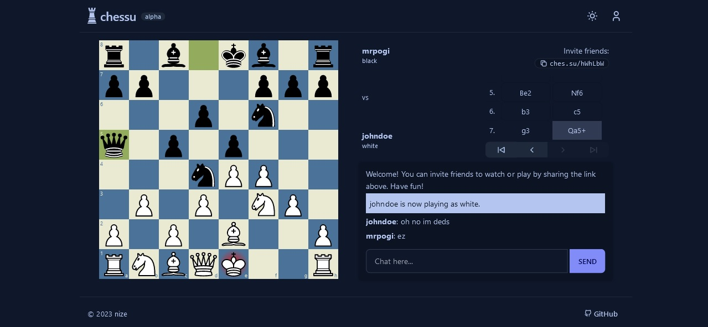

<h1 align="center">
  
</h1>
<p align="center">
  <a href="https://ches.su">
    
  </a>
  
</p>

<p align="center">Yet another Chess web app.

<p align="center">
  
</p>

- play against other users in real-time
- spectate and chat in ongoing games with other users
- _optional_ user accounts for tracking stats and game history
- ~~play solo against Stockfish~~ (wip)
- mobile-friendly
- ... and more ([view roadmap](https://github.com/users/dotnize/projects/2))

Built with Next.js 14, Tailwind CSS + daisyUI, react-chessboard, chess.js, Express.js, socket.io and PostgreSQL.

## Development

> Node.js 20 or newer is recommended.

This project is structured as a monorepo using **pnpm** workspaces, separated into three packages:

- `client` - Next.js application for the front-end, ~~deployed to ches.su via Vercel~~.
- `server` - Node/Express.js application for the back-end, ~~deployed to server.ches.su via Railway~~.
- `types` - Shared type definitions required by the client and server.

### Getting started

1. Install [pnpm](https://pnpm.io/installation).
2. Install the necessary dependencies by running `pnpm install` in the root directory of the project.
3. In the `server` directory, create a `.env` file for your PostgreSQL database. You can try [ElephantSQL](https://www.elephantsql.com/) or [Aiven](https://aiven.io/postgresql) for a free hosted database.
   ```env
   PGHOST=db.example.com
   PGUSER=exampleuser
   PGPASSWORD=examplepassword
   PGDATABASE=chessu
   ```
4. Run the development servers with `pnpm dev`.
   - To run the frontend and backend servers separately, use `pnpm dev:client` and `pnpm dev:server`, respectively.
5. You can now access the frontend at http://localhost:3000 and the backend at http://localhost:3001.

## Contributing

Please read our [Contributing Guidelines](./CONTRIBUTING.md) before starting a pull request.

## License

[MIT](./LICENSE)
