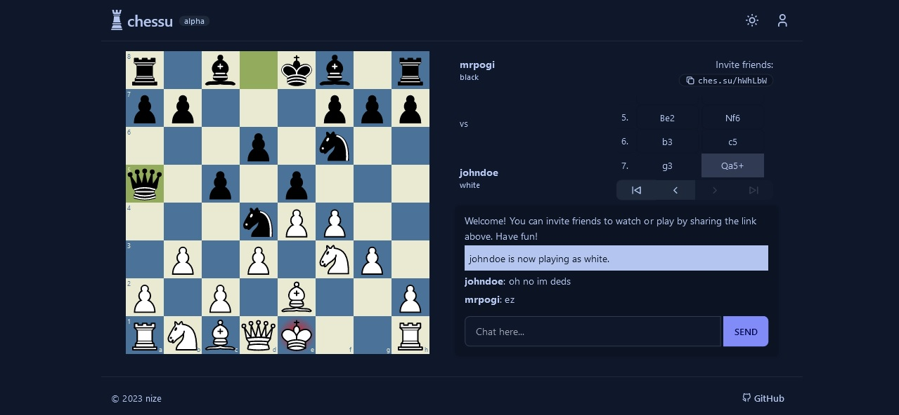

<h1 align="center">
  
</h1>
<p align="center">
  <a href="https://ches.su">
    
  </a>
  
</p>

<p align="center">Yet another Chess web app.

<p align="center">
  
</p>

- play against other users in real-time
- spectate and chat in ongoing games with other users
- _optional_ user accounts for tracking stats and game history
- ~~play solo against Stockfish~~ (wip)
- mobile-friendly
- ... and more ([view roadmap](https://github.com/users/dotnize/projects/2))

Built with TanStack Start, Elysia, Tailwind CSS + shadcn/ui, react-chessboard, and chess.js.

## Development

This project is structured as a monorepo using Turborepo and Bun.

```sh
├── apps
│   ├── api               # Elysia backend server
│   └── web               # TanStack Start web app
├── packages
│   ├── auth              # Better Auth
│   ├── db                # Drizzle ORM
│   └── ui                # shadcn/ui components
└── tooling
    ├── eslint-config     # Shared ESLint config
    └── tsconfig          # Shared TypeScript config
```

### Getting started

1. Install [bun](http://bun.com/docs/installation).
2. Install the necessary dependencies by running `bun install` in the root directory of the project.
3. Run the development servers with `bun dev`.
   - To run the web app and API servers separately, use `bun dev:web` and `bun dev:api`, respectively.
   - You may also use `./dev.sh` to start both servers with a local PostgreSQL database using Docker Compose.
4. You can now access the web app at http://localhost:3000 and the API at http://localhost:3001.

## Running chessu with Docker

To build the project with Docker, you can use the provided `Dockerfile`.

```sh
docker build -t chessu .
```

This command will build the Docker image with the name `chessu`. You can then run the image with the following command:

```sh
docker run -p 3000:3000 -p 3001:3001 chessu
```

Once built, to start the project with POSTGRES, you can use the provided `docker-compose.yml` file.

```sh
docker-compose up
```

Please make sure to modify the values in the `server/.env` file to match the values in the `docker-compose.yml` file or vice versa.

The entrypoint for the Docker image is set to run pnpm.
The Dockerfile's `CMD` instruction is set to run the project in production mode.
If you want to run the project in development mode, you can override the `CMD` instruction by running the following command:

```sh
docker run -p 3000:3000 -p 3001:3001 chessu dev # runs both client and server in development mode
docker run -p 3000:3000 -p 3001:3001 chessu dev:client # runs only the client in development mode
docker run -p 3000:3000 -p 3001:3001 chessu dev:server # runs only the server in development mode
```

## Contributing

Please read our [Contributing Guidelines](./CONTRIBUTING.md) before starting a pull request.

## License

[MIT](./LICENSE)
